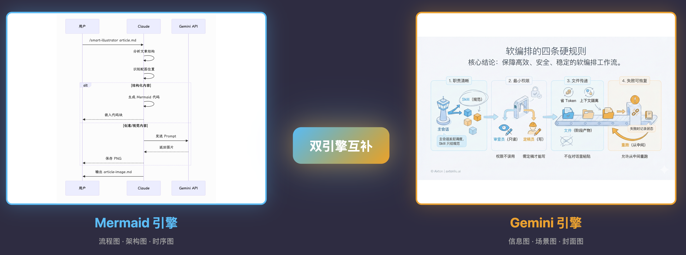

# DrawLang (绘语) - 中文优先的 AI 配图工具

[English](README.md) | **简体中文**

[](https://opensource.org/licenses/MIT)
[](https://modelscope.cn/models/Tongyi-MAI/Z-Image-Turbo)

> **🎯 专为中文内容创作者打造的 AI 配图工具**
>
> Style × Layout 二维矩阵设计 · ModelScope 原生中文 · 免费额度 · 完美适配中文平台



## 🌟 核心优势

### 1. 🎨 Style × Layout 二维矩阵

**独创二维设计系统**，自由组合视觉风格和信息布局：

```bash
# Style 控制视觉（颜色、线条、装饰）
--style notion    # 极简手绘
--style fresh     # 清新自然
--style warm      # 温馨友好

# Layout 控制结构（密度、排列）
--layout sparse      # 稀疏布局（1-2要点）
--layout balanced    # 平衡布局（3-4要点）
--layout dense       # 密集布局（5-8要点）
--layout list        # 列表布局（4-7项）
--layout comparison  # 对比布局（A vs B）

# 自由组合
/drawlang article.md --style notion --layout dense
# = 极简手绘风格 + 高密度知识卡片
```

## 🌟 为什么选择这个工具？

### 痛点 1：英文 AI 工具不理解中文
- ❌ 国外 AI 工具对中文 Prompt 理解不准确
- ❌ 生成的图片中文字模糊、乱码
- ❌ 不理解中国文化元素和视觉习惯

### 痛点 2：成本高昂
- ❌ Gemini、DALL-E 等工具按张收费，成本高
- ❌ 没有免费额度，试用成本高
- ❌ 批量生成时费用快速累积

### 痛点 3：尺寸不适配中文平台
- ❌ 默认尺寸不适合公众号、小红书
- ❌ 需要手动裁剪调整
- ❌ 浪费时间和精力

## ✨ 我们的解决方案

### 1. 🇨🇳 原生中文支持

**ModelScope Z-Image-Turbo**：阿里通义万相模型
- ✅ 原生理解中文 Prompt，生成准确
- ✅ 图片中的中英文文字清晰可读
- ✅ 理解中国文化元素（如春节、中秋等）

```bash
# 中文 Prompt 示例
/smart-illustrator article.md --prompt "一个温馨的中秋节场景，圆月高挂，家人围坐赏月"
```

### 2. 💰 免费额度 + 低成本

| 对比项 | ModelScope | Gemini | DALL-E 3 |
|--------|-----------|--------|----------|
| 免费额度 | ✅ 有 | ❌ 无 | ❌ 无 |
| 单张成本 | 💰 免费起 | 💰💰 ¥1/张 | 💰💰💰 ¥2/张 |
| 批量优惠 | ✅ 有 | ❌ 无 | ❌ 无 |

**成本对比（生成 100 张图）：**
- ModelScope：¥0（免费额度内）或 ¥10-20
- Gemini：¥100
- DALL-E 3：¥200

### 3. 🎨 完美适配中文平台

预设了所有主流中文平台的尺寸：

| 平台 | 尺寸 | 用途 | 命令 |
|------|------|------|------|
| 公众号 | 2.35:1 | 封面图 | `--platform wechat` |
| 小红书 | 3:4 | 竖图 | `--platform xiaohongshu` |
| B站 | 16:9 | 视频封面 | `--platform youtube` |
| 知乎 | 16:9 | 文章配图 | `--platform landscape` |

## 🚀 5 分钟快速上手

### 步骤 1：安装工具

```bash
# 克隆项目
git clone https://github.com/yuezheng2006/smart-illustrator.git ~/.claude/skills/smart-illustrator

# 安装依赖（可选）
cd ~/.claude/skills/smart-illustrator/scripts
npm install
```

### 步骤 2：获取 API Key

访问 [ModelScope 个人中心](https://modelscope.cn/my/myaccesstoken)，创建 API Token

```bash
# 设置环境变量
export MODELSCOPE_API_KEY=ms-你的密钥
```

### 步骤 3：开始使用

```bash
# 为文章生成配图
/smart-illustrator 我的文章.md

# 生成公众号封面
/smart-illustrator 我的文章.md --mode cover --platform wechat

# 生成小红书配图
/smart-illustrator 我的文章.md --platform xiaohongshu --count 5
```

## 📚 使用场景

### 场景 1：公众号运营

**需求**：每周发布 3 篇文章，每篇需要 1 个封面 + 3 张配图

```bash
# 一键生成所有配图
/smart-illustrator 本周文章1.md --platform wechat --count 3
/smart-illustrator 本周文章2.md --platform wechat --count 3
/smart-illustrator 本周文章3.md --platform wechat --count 3

# 成本：¥0（使用 ModelScope 免费额度）
# 时间：每篇 2-3 分钟
```

### 场景 2：小红书博主

**需求**：每天发布 1-2 条图文，每条需要 5-9 张竖图

```bash
# 批量生成小红书图文
/smart-illustrator 今日分享.md --platform xiaohongshu --count 9

# 输出：9 张 3:4 竖图，完美适配小红书
```

### 场景 3：B站 UP 主

**需求**：每周发布 2 个视频，需要封面图

```bash
# 生成 B站封面
/smart-illustrator 视频脚本1.md --mode cover --platform youtube
/smart-illustrator 视频脚本2.md --mode cover --platform youtube

# 输出：16:9 横图，适合 B站/YouTube
```

### 场景 4：技术博客

**需求**：技术文章需要流程图、架构图等

```bash
# 自动识别内容类型，选择最佳引擎
/smart-illustrator 技术文章.md --engine auto

# 工具会自动：
# - 流程图 → 使用 Mermaid 生成
# - 架构图 → 使用 Excalidraw 生成
# - 场景图 → 使用 ModelScope 生成
```

## 🎯 核心功能

### 1. 智能引擎选择

工具会根据内容自动选择最佳生成引擎：

```
分析文章内容
    ↓
├─ 需要流程图/时序图？ → Mermaid（结构化图表）
├─ 需要概念图/草图？ → Excalidraw（手绘风格）
└─ 需要场景图/创意图？ → ModelScope/Gemini（AI 生成）
```

### 2. 多提供商支持

支持 3 个图像生成提供商，自动切换：

| 提供商 | 优势 | 适用场景 |
|--------|------|---------|
| **ModelScope** | 免费额度、中文原生 | 日常使用、批量生成 |
| **Gemini** | 质量最高、细节丰富 | 重要场合、创意视觉 |
| **OpenRouter** | 消费限额、统一接口 | 成本控制、API 聚合 |

```bash
# 自动选择（优先级：OpenRouter > ModelScope > Gemini）
/smart-illustrator article.md

# 手动指定
/smart-illustrator article.md --provider modelscope
/smart-illustrator article.md --provider gemini
```

### 3. 风格定制

内置多种风格，支持自定义：

```bash
# 浅色风格（默认）
/smart-illustrator article.md --style light

# 深色科技风
/smart-illustrator article.md --style dark

# 极简风格
/smart-illustrator article.md --style minimal

# 自定义风格
# 1. 创建 styles/style-custom.md
# 2. 使用自定义风格
/smart-illustrator article.md --style custom
```

### 4. 批量生成

支持批量生成，自动断点续传：

```bash
# 从 JSON 配置批量生成
npx -y bun ~/.claude/skills/smart-illustrator/scripts/batch-generate.ts \
  --config slides.json \
  --output-dir ./images

# 特性：
# ✅ 自动跳过已生成的图片
# ✅ 支持重新生成指定图片
# ✅ 支持自定义文件名前缀
```

## 🛠️ 高级用法

### API 直接调用

```bash
# 单张图片生成
export MODELSCOPE_API_KEY=ms-your-key

npx -y bun ~/.claude/skills/smart-illustrator/scripts/generate-image.ts \
  --prompt "一只金色的猫坐在云朵上" \
  --output cat.png \
  --provider modelscope

# 指定尺寸和比例
npx -y bun generate-image.ts \
  --prompt "科技感的数据可视化界面" \
  --aspect-ratio 16:9 \
  --size 2k \
  --output dashboard.png

# 从文件读取 Prompt
npx -y bun generate-image.ts \
  --prompt-file prompt.md \
  --output result.png
```

### 配置文件

支持项目级和用户级配置：

```bash
# 项目级配置（当前项目）
# 创建 .smart-illustrator/config.json
{
  "references": ["./refs/style-1.png", "./refs/style-2.png"]
}

# 用户级配置（全局默认）
# 创建 ~/.smart-illustrator/config.json
{
  "references": ["~/my-style.png"]
}
```

## 💡 最佳实践

### 1. 中文 Prompt 写作技巧

```bash
# ✅ 好的 Prompt（具体、有画面感）
"一个现代简约风格的办公室，阳光透过落地窗洒在木质办公桌上，桌面摆放着笔记本电脑和咖啡杯，背景是城市天际线，色调温暖明亮"

# ⚠️ 一般的 Prompt（缺少细节）
"一个办公室场景"

# ❌ 不好的 Prompt（过于复杂）
"一个超级复杂的办公室，包含100个细节，每个细节都要非常精确..."
```

### 2. 成本优化策略

```bash
# 策略 1：日常使用 ModelScope，重要场合用 Gemini
export MODELSCOPE_API_KEY=ms-your-key
export GEMINI_API_KEY=your-gemini-key

# 日常文章（自动用 ModelScope）
/smart-illustrator daily-article.md

# 重要封面（手动指定 Gemini）
/smart-illustrator important-cover.md --provider gemini

# 策略 2：批量生成时优先 ModelScope
npx -y bun batch-generate.ts --config batch.json
# 默认使用 ModelScope，成本最低

# 策略 3：设置 OpenRouter 消费限额
export OPENROUTER_API_KEY=your-key
# OpenRouter 支持设置每月消费上限
```

### 3. 平台尺寸选择指南

| 内容类型 | 推荐平台 | 推荐尺寸 | 命令 |
|---------|---------|---------|------|
| 长文章 | 公众号 | 2.35:1 封面 + 3:4 正文 | `--platform wechat` |
| 短图文 | 小红书 | 3:4 竖图 × 9 | `--platform xiaohongshu` |
| 视频 | B站/YouTube | 16:9 横图 | `--platform youtube` |
| 专业文章 | 知乎/简书 | 16:9 横图 | `--platform landscape` |

## 🔧 技术细节

### 系统架构

```
用户输入
    ↓
内容分析（识别类型、位置）
    ↓
引擎选择
    ├─ Mermaid（结构化图表）
    ├─ Excalidraw（手绘风格）
    └─ AI 生成（ModelScope/Gemini）
        ↓
    提供商选择
        ├─ ModelScope（中文优先）
        ├─ Gemini（质量优先）
        └─ OpenRouter（成本控制）
            ↓
        图片生成
            ↓
        输出文件
```

### ModelScope API 特性

- **异步处理**：提交任务后轮询状态，不阻塞
- **双语支持**：原生支持中英文 Prompt
- **快速推理**：亚秒级生成（高端 GPU）
- **免费额度**：新用户有免费调用额度

### 环境变量配置

```bash
# ModelScope API（推荐）
export MODELSCOPE_API_KEY=ms-your-key

# Gemini API（备选）
export GEMINI_API_KEY=your-gemini-key

# OpenRouter API（备选）
export OPENROUTER_API_KEY=your-openrouter-key
```

## 📊 性能对比

### 生成速度

| 提供商 | 单张耗时 | 批量 10 张 |
|--------|---------|-----------|
| ModelScope | ~5-10秒 | ~1-2分钟 |
| Gemini | ~3-5秒 | ~30-50秒 |
| OpenRouter | ~3-5秒 | ~30-50秒 |

### 质量对比

| 维度 | ModelScope | Gemini | 说明 |
|------|-----------|--------|------|
| 中文理解 | ⭐⭐⭐⭐⭐ | ⭐⭐⭐ | ModelScope 原生中文 |
| 图片质量 | ⭐⭐⭐⭐ | ⭐⭐⭐⭐⭐ | Gemini 细节更丰富 |
| 文字渲染 | ⭐⭐⭐⭐⭐ | ⭐⭐⭐ | ModelScope 中文清晰 |
| 创意性 | ⭐⭐⭐⭐ | ⭐⭐⭐⭐⭐ | Gemini 更有创意 |

## 🤝 贡献指南

欢迎贡献！特别欢迎：

- 🇨🇳 中文场景优化建议
- 🎨 新的风格模板
- 📱 新的平台尺寸预设
- 🐛 Bug 修复和功能改进

提交 Issue：https://github.com/yuezheng2006/smart-illustrator/issues

## 📄 开源协议

MIT License

## 🙏 致谢

本项目基于 [axtonliu/smart-illustrator](https://github.com/axtonliu/smart-illustrator) 开发，感谢原作者的优秀工作。

**本分支的主要改进：**
- ✅ 集成 ModelScope Z-Image-Turbo
- ✅ 优化中文 Prompt 支持
- ✅ 添加免费额度选项
- ✅ 增强中文平台适配
- ✅ 完善中文文档

---

**Made with ❤️ for Chinese Content Creators**

如有问题或建议，欢迎提 Issue 或加入讨论！
