# DrawLang (绘语) 设计文档

> **一句话定位**：DrawLang 不是图片生成器，而是一套**视觉思维系统**——帮助中文内容创作者把文字思考转化为精准视觉表达。
>
> **基于**：[axtonliu/smart-illustrator](https://github.com/axtonliu/smart-illustrator)
>
> **源码**：[github.com/yuezheng2006/drawlang](https://github.com/yuezheng2006/drawlang)
>
> **当前范围**：文章配图 + PPT/Slides + Cover 封面图。

---

## 目录

- [1. 设计哲学（Why）](#1-设计哲学why)
- [2. 架构总览（What）](#2-架构总览what)
- [3. Style × Layout 二维矩阵（核心创新）](#3-style--layout-二维矩阵核心创新)
- [4. 三引擎路由系统](#4-三引擎路由系统)
- [5. 三种模式设计](#5-三种模式设计)
- [6. 多提供商抽象](#6-多提供商抽象)
- [7. 学习反馈系统](#7-学习反馈系统)
- [8. 配置与扩展](#8-配置与扩展)
- [9. 与同类工具对比](#9-与同类工具对比)

---

## 1. 设计哲学（Why）

DrawLang 的设计从三个出发点开始，它们相互支撑、缺一不可：

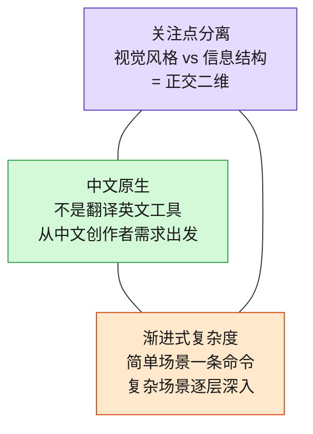
```mermaid
graph TB
    A["关注点分离<br/>视觉风格 vs 信息结构<br/>= 正交二维"]
    B["中文原生<br/>不是翻译英文工具<br/>从中文创作者需求出发"]
    C["渐进式复杂度<br/>简单场景一条命令<br/>复杂场景逐层深入"]

    A --- B
    B --- C
    C --- A

    style A fill:#e5dbff,stroke:#5f3dc4,color:#1a1a1a
    style B fill:#d3f9d8,stroke:#2f9e44,color:#1a1a1a
    style C fill:#ffe8cc,stroke:#d9480f,color:#1a1a1a
```

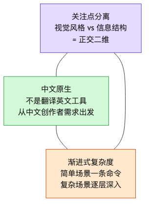

### 1.1 关注点分离

传统配图工具把"长什么样"和"放多少内容"混在一起——你选了一个模板，样式和信息量同时被锁定。

DrawLang 将两者分离为正交的两个维度：

- **Style（视觉风格）**：控制颜色、线条、装饰、情绪
- **Layout（信息布局）**：控制信息密度、排列方式、内容容量

这意味着 `--style notion --layout dense` 和 `--style warm --layout sparse` 可以自由组合，理论上产生 **7 × 5 = 35** 种不同的视觉表达。

### 1.2 中文原生

DrawLang 不是"给英文工具加个中文翻译"：

- **ModelScope 中文理解**：Z-Image-Turbo 原生理解中文 prompt，不需要翻译
- **中文平台适配**：内置公众号（2.35:1）、小红书（3:4）、B 站（16:9）等尺寸预设
- **中文推导，英文生成**：隐喻设计用中文思考（母语思维更精准），最终 prompt 用英文（模型生成效果更好）
- **字号保护**：中文最小 14px（Excalidraw 中强制执行）

### 1.3 渐进式复杂度

入门零门槛，深入无天花板：

```bash
# 最简——一条命令，全部默认
/drawlang article.md

# 进阶——指定风格和布局
/drawlang article.md --style notion --layout dense

# 专业——Cover 模式 + 指定平台
/drawlang --mode cover --platform youtube --topic "Claude 4 深度评测"
```

---

## 2. 架构总览（What）

### 2.1 五层洋葱架构

DrawLang 采用由外到内的五层架构，每层职责清晰：

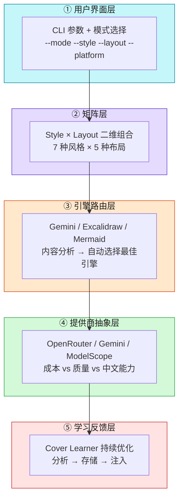
```mermaid
graph TB
    subgraph L1["① 用户界面层"]
        UI["CLI 参数 + 模式选择<br/>--mode --style --layout --platform"]
    end

    subgraph L2["② 矩阵层"]
        Matrix["Style × Layout 二维组合<br/>7 种风格 × 5 种布局"]
    end

    subgraph L3["③ 引擎路由层"]
        Router["Gemini / Excalidraw / Mermaid<br/>内容分析 → 自动选择最佳引擎"]
    end

    subgraph L4["④ 提供商抽象层"]
        Provider["OpenRouter / Gemini / ModelScope<br/>成本 vs 质量 vs 中文能力"]
    end

    subgraph L5["⑤ 学习反馈层"]
        Learner["Cover Learner 持续优化<br/>分析 → 存储 → 注入"]
    end

    UI --> Matrix --> Router --> Provider --> Learner

    style L1 fill:#c5f6fa,stroke:#0c8599,color:#1a1a1a
    style L2 fill:#e5dbff,stroke:#5f3dc4,color:#1a1a1a
    style L3 fill:#ffe8cc,stroke:#d9480f,color:#1a1a1a
    style L4 fill:#d3f9d8,stroke:#2f9e44,color:#1a1a1a
    style L5 fill:#ffe3e3,stroke:#c92a2a,color:#1a1a1a
```

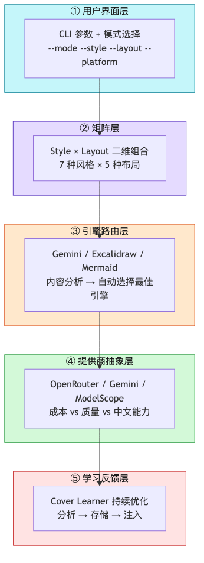

| 层 | 职责 | 关键文件 |
| -- | ---- | ------- |
| ① 用户界面层 | 解析 CLI 参数，选择模式 | `SKILL.md` |
| ② 矩阵层 | 组合 Style 和 Layout | `styles/style-*.md` + `styles/layouts/layout-*.md` |
| ③ 引擎路由层 | 根据内容类型选择渲染引擎 | `references/excalidraw-guide.md` |
| ④ 提供商抽象层 | 路由到最佳图像生成 API | `scripts/generate-image.ts` + `scripts/config.ts` |
| ⑤ 学习反馈层 | 从历史封面中提取可复用模式 | `scripts/cover-learner.ts` + `prompts/learning-analysis.md` |

### 2.2 完整执行流程

从用户输入到文件输出的全链路：

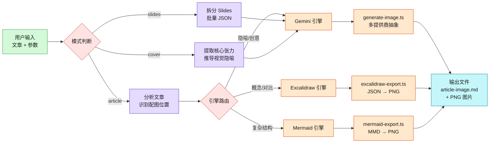
```mermaid
flowchart LR
    A[用户输入<br/>文章 + 参数] --> B{模式判断}

    B -->|article| C[分析文章<br/>识别配图位置]
    B -->|slides| D[拆分 Slides<br/>批量 JSON]
    B -->|cover| E[提取核心张力<br/>推导视觉隐喻]

    C --> G{引擎路由}
    G -->|隐喻/创意| H[Gemini 引擎]
    G -->|概念/对比| I[Excalidraw 引擎]
    G -->|复杂结构| J[Mermaid 引擎]

    D --> H
    E --> H

    H --> K[generate-image.ts<br/>多提供商抽象]
    I --> L[excalidraw-export.ts<br/>JSON → PNG]
    J --> M[mermaid-export.ts<br/>MMD → PNG]

    K --> N[输出文件<br/>article-image.md<br/>+ PNG 图片]
    L --> N
    M --> N

    classDef input fill:#d3f9d8,stroke:#2f9e44,color:#1a1a1a
    classDef process fill:#e5dbff,stroke:#5f3dc4,color:#1a1a1a
    classDef decision fill:#ffe3e3,stroke:#c92a2a,color:#1a1a1a
    classDef action fill:#ffe8cc,stroke:#d9480f,color:#1a1a1a
    classDef output fill:#c5f6fa,stroke:#0c8599,color:#1a1a1a

    class A input
    class B decision
    class C,D,E process
    class G decision
    class H,I,J,K,L,M action
    class N output
```

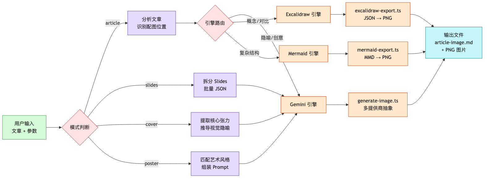

---

## 3. Style × Layout 二维矩阵（核心创新）

### 3.1 为什么是二维而非一维？

传统工具（如 baoyu-infographic）的 Type × Style 是**一维选择**——选了 Type 就基本锁定了视觉表现。DrawLang 的创新在于将**视觉表现**和**信息架构**拆成两个独立可控的维度：

| 对比 | 一维模型 | DrawLang 二维矩阵 |
| ---- | ------- | ----------------- |
| 选择方式 | 选一个模板（样式 + 布局绑定） | 分别选 Style 和 Layout |
| 组合数 | N 种 | N × M 种 |
| 灵活度 | 低（换模板 = 全部重来） | 高（只调一个维度） |
| 复用性 | 低 | 同一 Layout 可配不同 Style |

### 3.2 Style 维度：7 种视觉语言

> **注**：项目中有多个 `style-*.md` 文件，其中 `style-cover.md` 是**模式专用**（Cover 模式），不参与 Style × Layout 矩阵。矩阵中的 7 种 Style 是通用视觉风格。

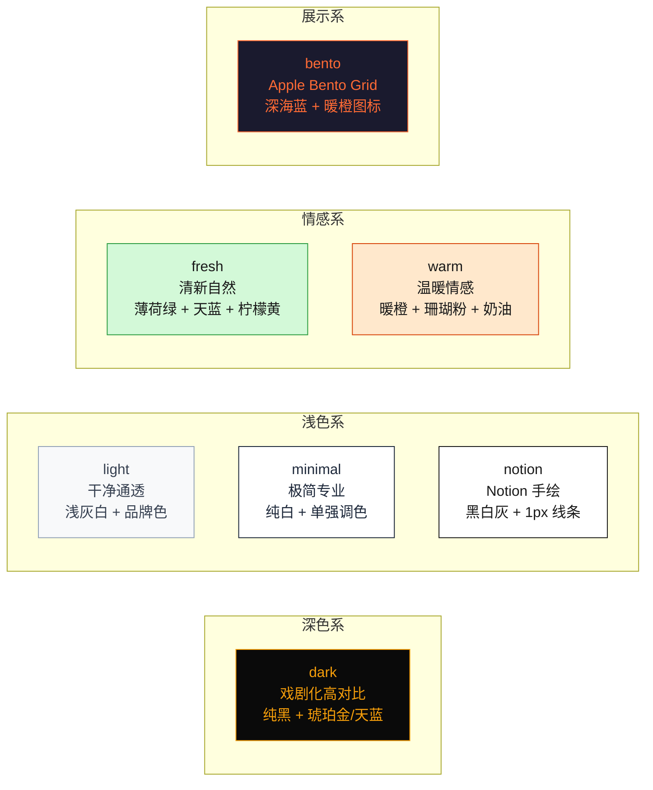
```mermaid
graph LR
    subgraph 深色系
        dark["dark<br/>戏剧化高对比<br/>纯黑 + 琥珀金/天蓝"]
    end

    subgraph 浅色系
        light["light<br/>干净通透<br/>浅灰白 + 品牌色"]
        minimal["minimal<br/>极简专业<br/>纯白 + 单强调色"]
        notion["notion<br/>Notion 手绘<br/>黑白灰 + 1px 线条"]
    end

    subgraph 情感系
        fresh["fresh<br/>清新自然<br/>薄荷绿 + 天蓝 + 柠檬黄"]
        warm["warm<br/>温暖情感<br/>暖橙 + 珊瑚粉 + 奶油"]
    end

    subgraph 展示系
        bento["bento<br/>Apple Bento Grid<br/>深海蓝 + 暖橙图标"]
    end

    style dark fill:#0a0a0a,stroke:#F59E0B,color:#F59E0B
    style light fill:#F8F9FA,stroke:#94A3B8,color:#374151
    style minimal fill:#FFFFFF,stroke:#1E293B,color:#1E293B
    style notion fill:#FFFFFF,stroke:#1a1a1a,color:#1a1a1a
    style fresh fill:#d3f9d8,stroke:#2f9e44,color:#1a1a1a
    style warm fill:#ffe8cc,stroke:#d9480f,color:#1a1a1a
    style bento fill:#1a1a2e,stroke:#ff6b35,color:#ff6b35
```

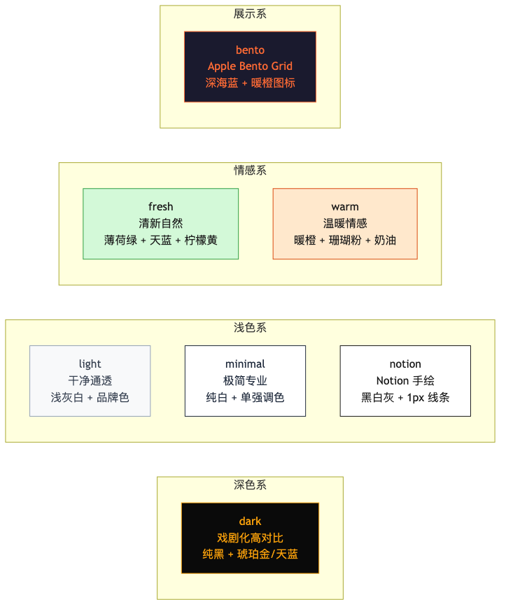

每种风格的详细设计语言对比：

| Style | 色板来源 | 装饰度 | 情绪 | 最佳场景 |
| ----- | ------- | ------ | ---- | ------- |
| **light** | Light Neutral | 75% 几何 + 25% 手绘 | 专业、清新 | 正文配图、教程 |
| **dark** | Brand Signature | 戏剧化光影 | 高端、沉浸 | 封面图、展示页 |
| **minimal** | Minimal Slate | 60%+ 留白 | 克制、知性 | 技术文档、白皮书 |
| **notion** | 黑白灰 | 1px 线条、线框图标 | 知识感、笔记风 | 知识卡片、教程 |
| **fresh** | 薄荷/天蓝/柠檬 | 圆角、柔和曲线 | 活力、健康 | 健康/美食/生活内容 |
| **warm** | 暖橙/珊瑚/奶油 | 心形元素、手绘感 | 温暖、亲切 | 家庭/情感/育儿 |
| **bento** | High Contrast | 网格卡片、不等分 | 科技感、产品力 | 产品发布、功能展示 |

### 3.3 Layout 维度：5 种信息密度

Layout 控制的是"一张图承载多少信息"——从极简到密集，形成一个连续的信息密度谱：

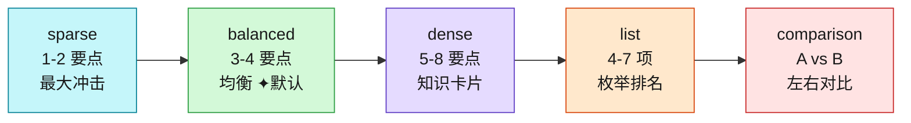
```mermaid
graph LR
    S["sparse<br/>1-2 要点<br/>最大冲击"] --> BA["balanced<br/>3-4 要点<br/>均衡 ✦默认"] --> D["dense<br/>5-8 要点<br/>知识卡片"] --> L["list<br/>4-7 项<br/>枚举排名"] --> C["comparison<br/>A vs B<br/>左右对比"]

    style S fill:#c5f6fa,stroke:#0c8599,color:#1a1a1a
    style BA fill:#d3f9d8,stroke:#2f9e44,color:#1a1a1a
    style D fill:#e5dbff,stroke:#5f3dc4,color:#1a1a1a
    style L fill:#ffe8cc,stroke:#d9480f,color:#1a1a1a
    style C fill:#ffe3e3,stroke:#c92a2a,color:#1a1a1a
```

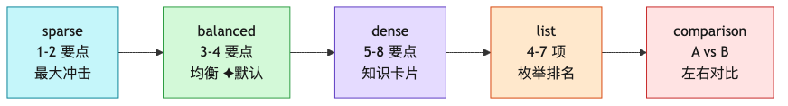

| Layout | 主元素占比 | 信息密度 | 适用内容 |
| ------ | --------- | ------- | ------- |
| **sparse** | 60-80% | 最低 | 单一概念、品牌图、英雄图 |
| **balanced** | 40-50% 主 + 20-30% 辅 | 中等 | 大多数文章配图（默认） |
| **dense** | 60-70% 内容 | 高 | 知识卡片、数据摘要、要点总结 |
| **list** | 垂直枚举 | 中高 | 排名、步骤、清单 |
| **comparison** | 左右各 50% | 中等 | A vs B、新旧对比、方案比较 |

### 3.4 组合兼容性矩阵

并非所有组合都同样适用。以下矩阵标注了推荐程度：

| | sparse | balanced | dense | list | comparison |
| -- | ------ | -------- | ----- | ---- | ---------- |
| **light** | ✓ | ✓✓ | ✓✓ | ✓✓ | ✓✓ |
| **dark** | ✓✓ | ✓ | ✗ | ✗ | ✓ |
| **minimal** | ✓✓ | ✓✓ | ✓ | ✓ | ✓✓ |
| **notion** | ✓ | ✓✓ | ✓✓ | ✓✓ | ✓✓ |
| **fresh** | ✓ | ✓✓ | ✓ | ✓✓ | ✓ |
| **warm** | ✓✓ | ✓✓ | ✓ | ✓ | ✗ |
| **bento** | ✗ | ✓ | ✓✓ | ✓ | ✓✓ |

- **✓✓** 推荐：风格和布局相得益彰
- **✓** 可用：能正常工作但不是最佳搭配
- **✗** 不推荐：风格特性与布局需求冲突（如 dark 的戏剧化光影在 dense 布局中信息过载）

以下是同一篇文章（AI Agent 编排层）在不同 Style × Layout 组合下的实际生成效果：

| Light + Balanced | Notion + Dense | Light + Comparison |
| :---: | :---: | :---: |
| 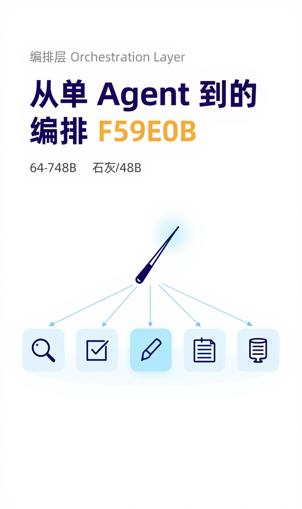 | 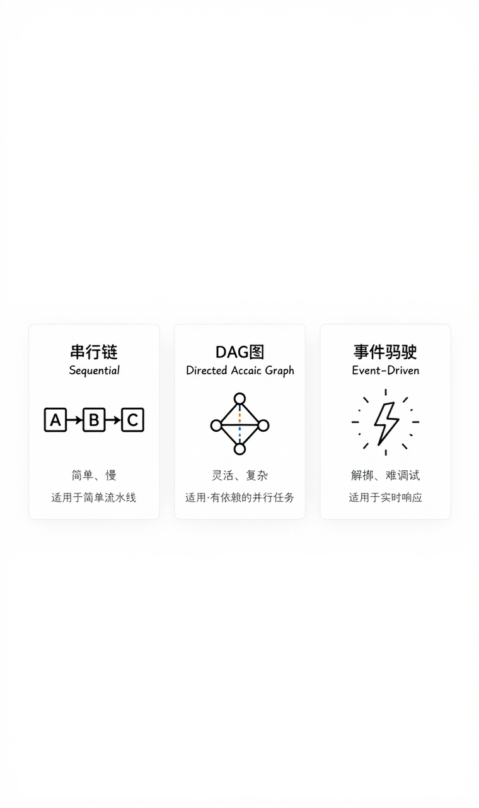 | 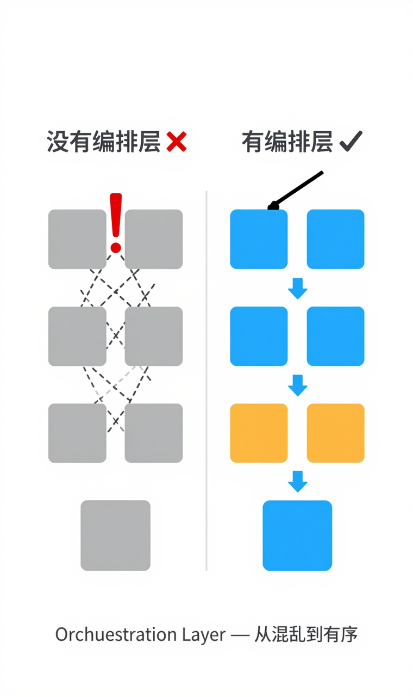 |
| 指挥棒隐喻，5个Agent弧形排列 | 三列知识卡片，极简手绘 | 左右对比：混乱 vs 有序 |

| Light + Sparse |
| :---: |
| 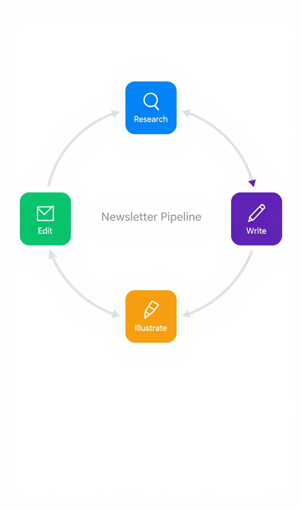 |
| 环形流程图，大面积留白，单一视觉冲击 |

---

## 4. 三引擎路由系统

### 4.1 设计思想

**没有万能引擎**。每种内容类型有其最佳的视觉表达方式：

- 有些概念需要**隐喻和情感**（Gemini 擅长的创意图像）
- 有些概念需要**关系和结构**（Excalidraw 的手绘概念图）
- 有些概念需要**精确的流程和时序**（Mermaid 的结构化图表）

### 4.2 引擎决策流程

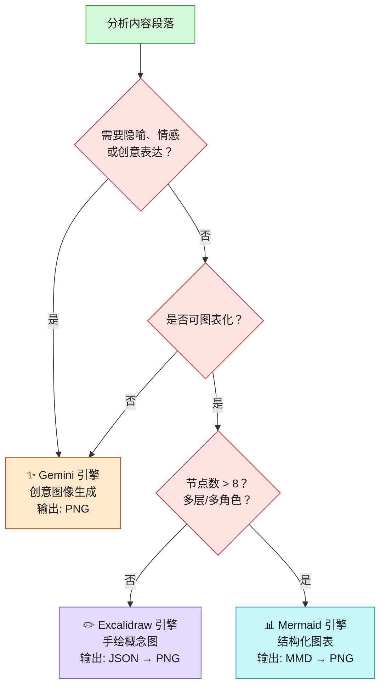
```mermaid
flowchart TD
    START[分析内容段落] --> Q1{需要隐喻、情感<br/>或创意表达？}

    Q1 -->|是| GEMINI["✨ Gemini 引擎<br/>创意图像生成<br/>输出: PNG"]

    Q1 -->|否| Q2{是否可图表化？}

    Q2 -->|否| GEMINI

    Q2 -->|是| Q3{节点数 > 8？<br/>多层/多角色？}

    Q3 -->|否| EXCALIDRAW["✏️ Excalidraw 引擎<br/>手绘概念图<br/>输出: JSON → PNG"]

    Q3 -->|是| MERMAID["📊 Mermaid 引擎<br/>结构化图表<br/>输出: MMD → PNG"]

    classDef input fill:#d3f9d8,stroke:#2f9e44,color:#1a1a1a
    classDef decision fill:#ffe3e3,stroke:#c92a2a,color:#1a1a1a
    classDef gemini fill:#ffe8cc,stroke:#d9480f,color:#1a1a1a
    classDef excalidraw fill:#e5dbff,stroke:#5f3dc4,color:#1a1a1a
    classDef mermaid fill:#c5f6fa,stroke:#0c8599,color:#1a1a1a

    class START input
    class Q1,Q2,Q3 decision
    class GEMINI gemini
    class EXCALIDRAW excalidraw
    class MERMAID mermaid
```

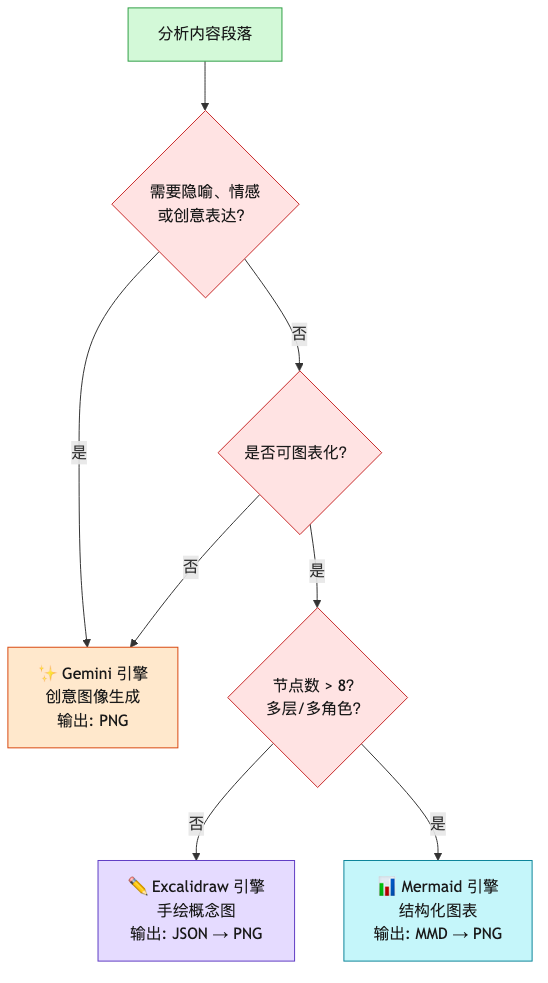

### 4.3 三引擎对比

| 维度 | Gemini | Excalidraw | Mermaid |
| ---- | ------ | ---------- | ------- |
| **优先级** | 1（最高） | 2 | 3（最低） |
| **擅长** | 隐喻、创意、情感 | 概念关系、对比、简单流程 | 复杂流程、时序、架构 |
| **视觉表现力** | 最强（照片级） | 强（手绘风格） | 弱（结构化图表） |
| **结构精确性** | 弱 | 中 | 最强 |
| **最大节点数** | N/A | ≤ 8 推荐 | ≤ 15 推荐 |
| **输出格式** | PNG | .excalidraw → PNG | .mmd → PNG |
| **可编辑性** | 不可 | 可（JSON 源文件） | 可（MMD 源文件） |

### 4.4 为什么 Excalidraw 优先于 Mermaid？

这是一个**视觉表现力 vs 结构精确性**的权衡：

- Excalidraw 的手绘风格让概念图更有"温度"——读者看到的不是冰冷的框线图，而是像白板上的草稿
- Mermaid 虽然结构精确，但视觉表现力有限——所有图看起来都很"工业化"
- **大多数文章配图的目标是提高吸引力**，而非追求技术精确性
- 因此：能用 Excalidraw 就不用 Mermaid，除非结构复杂度真的需要 Mermaid

### 4.5 Mermaid 语义色板

Mermaid 引擎使用语义化的色彩系统——每种颜色有固定含义，而非随机配色：

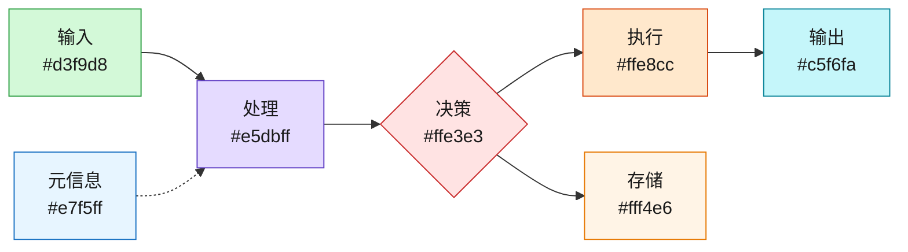
```mermaid
graph LR
    A["输入<br/>#d3f9d8"] --> B["处理<br/>#e5dbff"] --> C{"决策<br/>#ffe3e3"} --> D["执行<br/>#ffe8cc"] --> E["输出<br/>#c5f6fa"]
    C --> F["存储<br/>#fff4e6"]
    G["元信息<br/>#e7f5ff"] -.-> B

    classDef input fill:#d3f9d8,stroke:#2f9e44,color:#1a1a1a
    classDef process fill:#e5dbff,stroke:#5f3dc4,color:#1a1a1a
    classDef decision fill:#ffe3e3,stroke:#c92a2a,color:#1a1a1a
    classDef action fill:#ffe8cc,stroke:#d9480f,color:#1a1a1a
    classDef output fill:#c5f6fa,stroke:#0c8599,color:#1a1a1a
    classDef storage fill:#fff4e6,stroke:#e67700,color:#1a1a1a
    classDef meta fill:#e7f5ff,stroke:#1971c2,color:#1a1a1a

    class A input
    class B process
    class C decision
    class D action
    class E output
    class F storage
    class G meta
```

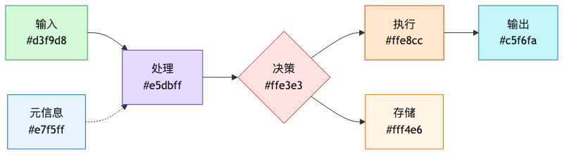

| 语义 | 填充色 | 边框色 | 用于 |
| ---- | ------ | ------ | ---- |
| input | `#d3f9d8` | `#2f9e44` | 输入、起点、数据源 |
| process | `#e5dbff` | `#5f3dc4` | 处理、推理、核心逻辑 |
| decision | `#ffe3e3` | `#c92a2a` | 决策点、分支判断 |
| action | `#ffe8cc` | `#d9480f` | 执行动作、工具调用 |
| output | `#c5f6fa` | `#0c8599` | 输出、结果、终点 |
| storage | `#fff4e6` | `#e67700` | 存储、记忆、数据库 |
| meta | `#e7f5ff` | `#1971c2` | 标题、分组、元信息 |

这套语义色板的好处：读者看到绿色就知道是输入，看到紫色就知道是处理逻辑——**颜色即语义**。

以下是三引擎对同一主题的不同表达方式：

| Gemini 创意隐喻 | Article 信息图（Light+Balanced） |
| :---: | :---: |
|  |  |
| 指挥棒+棋子，零文字，电影级打光 | 指挥棒+Agent方块，扁平几何，信息清晰 |

---

## 5. 四种模式设计

### 5.1 模式对比

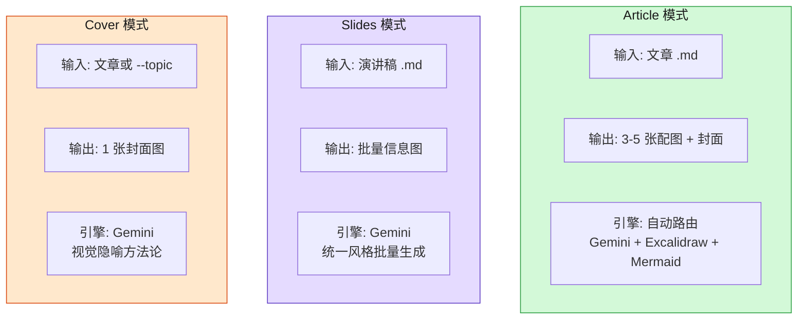
```mermaid
graph TB
    subgraph Article["Article 模式"]
        A1["输入: 文章 .md"]
        A2["输出: 3-5 张配图 + 封面"]
        A3["引擎: 自动路由<br/>Gemini + Excalidraw + Mermaid"]
    end

    subgraph Slides["Slides 模式"]
        S1["输入: 演讲稿 .md"]
        S2["输出: 批量信息图"]
        S3["引擎: Gemini<br/>统一风格批量生成"]
    end

    subgraph Cover["Cover 模式"]
        C1["输入: 文章或 --topic"]
        C2["输出: 1 张封面图"]
        C3["引擎: Gemini<br/>视觉隐喻方法论"]
    end

    style Article fill:#d3f9d8,stroke:#2f9e44,color:#1a1a1a
    style Slides fill:#e5dbff,stroke:#5f3dc4,color:#1a1a1a
    style Cover fill:#ffe8cc,stroke:#d9480f,color:#1a1a1a
```

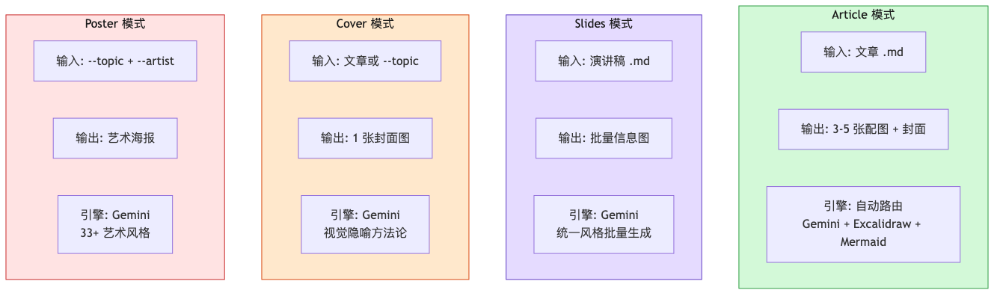

| 维度 | Article | Slides | Cover |
| ------ | --------- | -------- | ------- |
| **定位** | 文章配图 | 演讲信息图 | 封面/缩略图 |
| **输入** | 文章 + 参数 | 演讲稿 + 参数 | 文章/主题 |
| **图片数量** | 3-5 张 + 封面 | N 张（按页） | 1 张 |
| **引擎** | 自动路由 | Gemini | Gemini |
| **Style × Layout** | 完整支持 | 完整支持 | 仅 Style |
| **核心方法论** | 三引擎路由 | 批量 JSON | 视觉隐喻三步法 |

### 5.2 Cover 模式：视觉隐喻方法论

Cover 模式是 DrawLang 最独特的设计——它不是"画一张好看的图"，而是一套系统化的**视觉思维方法**。

#### 三步推导法

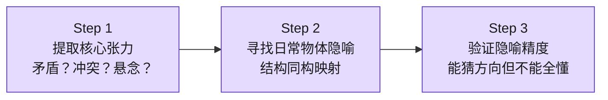
```mermaid
flowchart LR
    Step1["Step 1<br/>提取核心张力<br/>矛盾？冲突？悬念？"] --> Step2["Step 2<br/>寻找日常物体隐喻<br/>结构同构映射"] --> Step3["Step 3<br/>验证隐喻精度<br/>能猜方向但不能全懂"]

    classDef process fill:#e5dbff,stroke:#5f3dc4,color:#1a1a1a
    class Step1,Step2,Step3 process
```

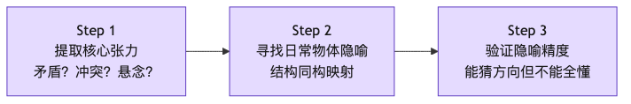

关键在于 Step 2 的"结构同构"——不是把物体放在奇怪的场景里，而是找到**物体本身结构**与**抽象概念**之间的映射：

| 主题 | 直译（禁止） | 好隐喻（追求） | 同构关系 |
| ------ | ------------- | ---------------- | --------- |
| 系统安全缺失 | 破碎的盾牌 | 玻璃展示箱缺了一整面墙 | 一面墙缺失 ↔ Sandbox: null |
| AI 编排协作 | 多个机器人并排 | 指挥棒面前悬浮着半透明棋子 | 指挥 ↔ 编排 |
| 效率革命 | 火箭 / 加速箭头 | 空荡荡的办公桌只剩一杯咖啡 | 人去哪了？ ↔ 缺席 |

#### 隐喻层次金字塔

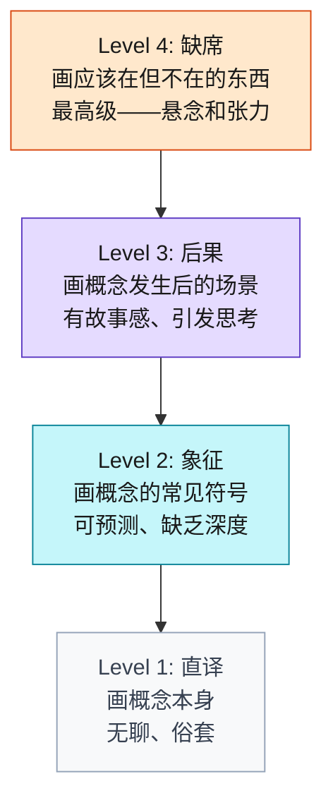
```mermaid
graph TB
    L4["Level 4: 缺席<br/>画应该在但不在的东西<br/>最高级——悬念和张力"]
    L3["Level 3: 后果<br/>画概念发生后的场景<br/>有故事感、引发思考"]
    L2["Level 2: 象征<br/>画概念的常见符号<br/>可预测、缺乏深度"]
    L1["Level 1: 直译<br/>画概念本身<br/>无聊、俗套"]

    L4 --> L3 --> L2 --> L1

    style L4 fill:#ffe8cc,stroke:#d9480f,color:#1a1a1a
    style L3 fill:#e5dbff,stroke:#5f3dc4,color:#1a1a1a
    style L2 fill:#c5f6fa,stroke:#0c8599,color:#1a1a1a
    style L1 fill:#f8f9fa,stroke:#94A3B8,color:#374151
```

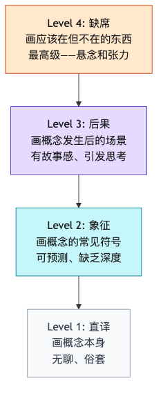

**核心原则**：永远优先使用"后果"和"缺席"层次的隐喻。

#### 高级技法（来自 Mondo 海报传统）

| 技法 | 描述 | 适用场景 | Prompt 关键词 |
| ------ | ------ | --------- | -------------- |
| **图底反转** | 剪影内部留空构成另一个形状 | 对立、冲突、双面性 | `figure-ground inversion` |
| **比例戏剧** | 微小主体 + 巨大物体 | 技术革命、范式转移 | `dramatic scale contrast` |
| **单一形状叙事** | 整个画面只有一个象征形状 | 提炼终极符号 | `single shape storytelling` |

#### Axton Cover Identity 色彩签名

每张 Cover 封面图都遵循统一的品牌色彩签名：

- **背景**：纯黑 `#0A0A0A`（无尽虚空）
- **主光**：琥珀金 `#F59E0B`（侧面照亮主体，~70%）
- **辅光**：天空蓝 `#38BDF8`（边缘轮廓光，~30%）
- **规则**：颜色通过**光线和折射**体现，不是涂在物体表面

<!-- IMAGE: Cover 隐喻三步推导示例——"AI Agent 编排" -->


### 5.3 Poster 模式（规划中）

Poster 模式（33+ 艺术风格、智能风格匹配）为规划中功能，当前版本未实现。

---

## 6. 多提供商抽象

### 6.1 为什么需要多提供商？

没有一个提供商能同时满足成本、质量、中文能力三个维度：

| 提供商 | 成本 | 质量 | 中文能力 | 特点 |
| -------- | ------ | ------ | --------- | ------ |
| **ModelScope** | 免费额度 | 中等 | 原生中文 | Z-Image-Turbo，异步任务 |
| **Gemini** | 按量付费 | 最高 | 英文优先 | 同步返回，质量最优 |
| **OpenRouter** | 灵活定价 | 可选 | 取决于模型 | 多模型路由，成本可控 |

### 6.2 提供商选择决策流程

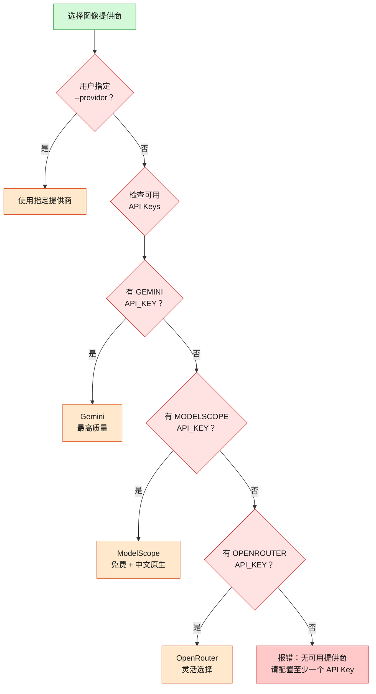
```mermaid
flowchart TD
    START[选择图像提供商] --> CLI{用户指定<br/>--provider？}

    CLI -->|是| USE_SPECIFIED[使用指定提供商]

    CLI -->|否| CHECK_KEYS{检查可用<br/>API Keys}

    CHECK_KEYS --> HAS_GEMINI{有 GEMINI<br/>API_KEY？}
    HAS_GEMINI -->|是| GEMINI[Gemini<br/>最高质量]
    HAS_GEMINI -->|否| HAS_MS{有 MODELSCOPE<br/>API_KEY？}
    HAS_MS -->|是| MODELSCOPE[ModelScope<br/>免费 + 中文原生]
    HAS_MS -->|否| HAS_OR{有 OPENROUTER<br/>API_KEY？}
    HAS_OR -->|是| OPENROUTER[OpenRouter<br/>灵活选择]
    HAS_OR -->|否| ERROR[报错：无可用提供商<br/>请配置至少一个 API Key]

    classDef decision fill:#ffe3e3,stroke:#c92a2a,color:#1a1a1a
    classDef action fill:#ffe8cc,stroke:#d9480f,color:#1a1a1a
    classDef output fill:#d3f9d8,stroke:#2f9e44,color:#1a1a1a
    classDef error fill:#ffc9c9,stroke:#c92a2a,color:#1a1a1a

    class START output
    class CLI,CHECK_KEYS,HAS_GEMINI,HAS_MS,HAS_OR decision
    class USE_SPECIFIED,GEMINI,MODELSCOPE,OPENROUTER action
    class ERROR error
```

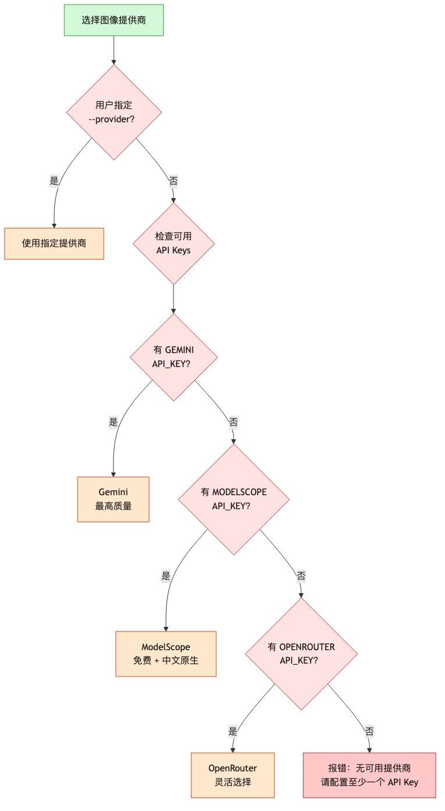

### 6.3 ModelScope 异步任务模型

ModelScope 使用异步任务模式，与 Gemini 的同步模式不同：

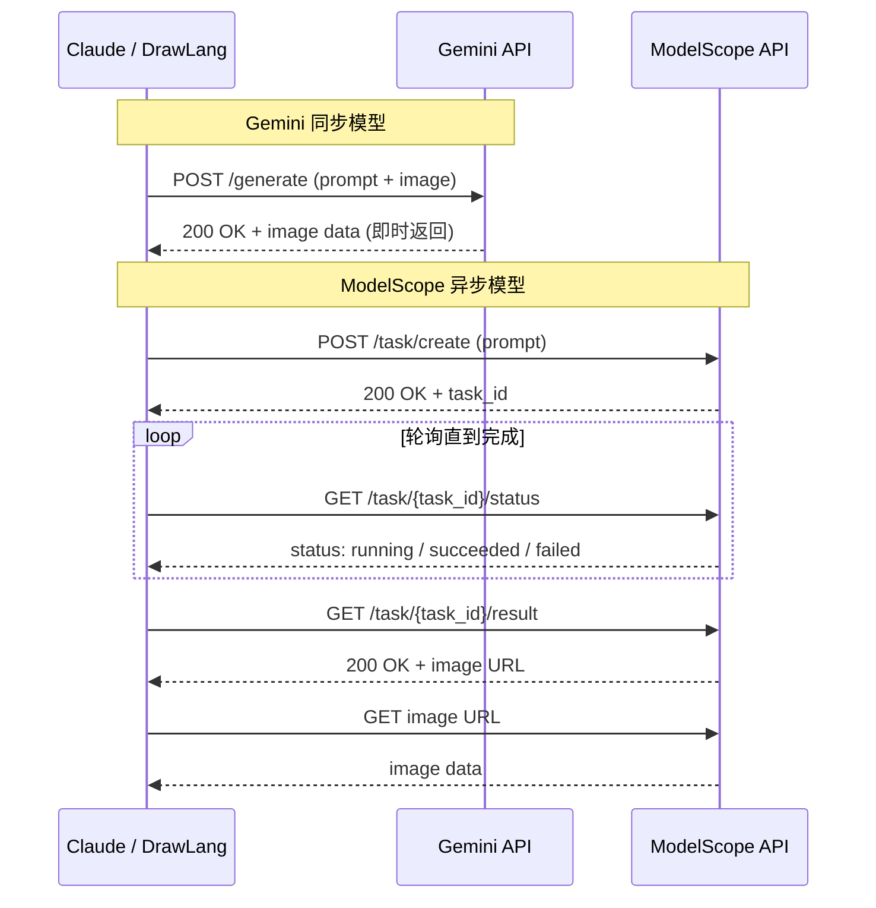
```mermaid
sequenceDiagram
    participant C as Claude / DrawLang
    participant G as Gemini API
    participant M as ModelScope API

    Note over C,G: Gemini 同步模型
    C->>G: POST /generate (prompt + image)
    G-->>C: 200 OK + image data (即时返回)

    Note over C,M: ModelScope 异步模型
    C->>M: POST /task/create (prompt)
    M-->>C: 200 OK + task_id
    loop 轮询直到完成
        C->>M: GET /task/{task_id}/status
        M-->>C: status: running / succeeded / failed
    end
    C->>M: GET /task/{task_id}/result
    M-->>C: 200 OK + image URL
    C->>M: GET image URL
    M-->>C: image data
```

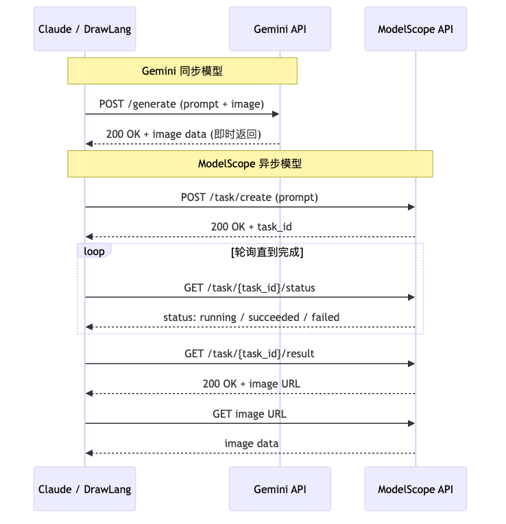

### 6.4 参考图 Style-Lock 机制

使用 `--ref` 参数时，DrawLang 会将参考图传递给图像生成 API，让新图"锁定"参考图的视觉风格：

- 支持多张参考图（`--ref img1.png --ref img2.png`）
- 提供商不支持参考图时自动降级为纯文本 prompt
- 参考图影响风格但不复制内容

---

## 7. 学习反馈系统

### 7.1 Cover Learner 设计理念

Cover Learner 是一个**渐进式学习系统**——从优秀的封面设计中提取可复用模式，逐步提升生成质量。

核心思想：**不是让 AI 记住一张好图，而是让 AI 理解为什么这张图好**。

### 7.2 学习闭环

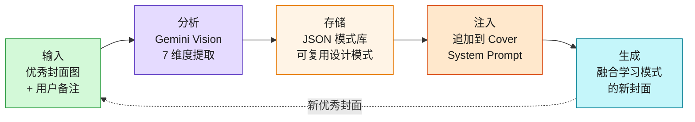
```mermaid
flowchart LR
    A["输入<br/>优秀封面图<br/>+ 用户备注"] --> B["分析<br/>Gemini Vision<br/>7 维度提取"]

    B --> C["存储<br/>JSON 模式库<br/>可复用设计模式"]

    C --> D["注入<br/>追加到 Cover<br/>System Prompt"]

    D --> E["生成<br/>融合学习模式<br/>的新封面"]

    E -.->|新优秀封面| A

    classDef input fill:#d3f9d8,stroke:#2f9e44,color:#1a1a1a
    classDef process fill:#e5dbff,stroke:#5f3dc4,color:#1a1a1a
    classDef storage fill:#fff4e6,stroke:#e67700,color:#1a1a1a
    classDef action fill:#ffe8cc,stroke:#d9480f,color:#1a1a1a
    classDef output fill:#c5f6fa,stroke:#0c8599,color:#1a1a1a

    class A input
    class B process
    class C storage
    class D action
    class E output
```

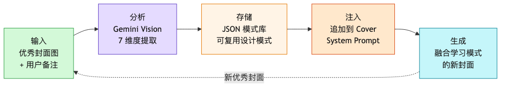

### 7.3 分析维度

Gemini Vision 从每张输入封面中提取 7 个维度的设计模式：

| 维度 | 分析内容 | 示例 |
| ------ | --------- | ------ |
| **composition** | 构图方式 | "左侧人物 + 右侧文字"、"中心聚焦" |
| **colorScheme** | 配色方案 | "深色背景 + 橙色强调"、"高对比冷暖搭配" |
| **textUsage** | 文字使用 | "无文字"、"3-5 个大字"、"数字突出" |
| **emotion** | 传达情绪 | "好奇心"、"紧迫感"、"专业感" |
| **focusPoint** | 视觉焦点 | "人物表情"、"产品 logo"、"对比元素" |
| **patterns** | 值得学习的模式 | "3 秒法则：标题可在 3 秒内读完" |
| **avoidPatterns** | 应避免的模式 | "文字过多导致移动端不可读" |

### 7.4 Varied Styles 双候选机制

Cover 模式的 `--varied` 参数会生成两种不同风格的封面供选择：

1. **Candidate 1: Dramatic & High-Contrast** — 戏剧性高对比，视觉冲击力优先
2. **Candidate 2: Minimal & Professional** — 极简专业，信息清晰优先

两个候选互补——确保用户总能找到合适的方向。

---

## 8. 配置与扩展

### 8.1 三级配置优先链

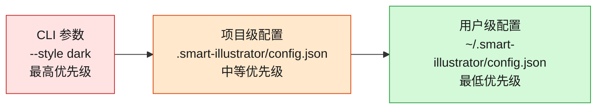
```mermaid
graph LR
    CLI["CLI 参数<br/>--style dark<br/>最高优先级"] --> PROJECT["项目级配置<br/>.smart-illustrator/config.json<br/>中等优先级"] --> USER["用户级配置<br/>~/.smart-illustrator/config.json<br/>最低优先级"]

    classDef high fill:#ffe3e3,stroke:#c92a2a,color:#1a1a1a
    classDef mid fill:#ffe8cc,stroke:#d9480f,color:#1a1a1a
    classDef low fill:#d3f9d8,stroke:#2f9e44,color:#1a1a1a

    class CLI high
    class PROJECT mid
    class USER low
```

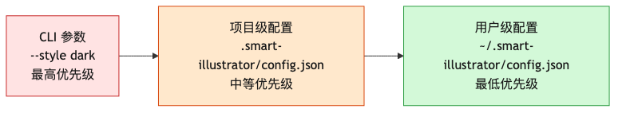

**规则**：高优先级配置覆盖低优先级。CLI 参数永远生效。

### 8.2 为什么 `--no-config` 不影响 Style 文件？

`--no-config` 禁用的是 `config.json`（运行时配置），**不影响** `styles/style-*.md`（设计规范文件）。

原因：Style 文件定义的是**设计语言**——颜色、线条、情绪。禁用它们会导致生成结果没有任何风格约束，失去 DrawLang 的核心价值。Style 文件是规则 2（强制规则）要求必须读取的。

### 8.3 如何自定义风格

1. **品牌色**：修改 `styles/brand-colors.md` 中的色板值
2. **新增风格**：复制一个 `styles/style-*.md` 文件，修改 System Prompt
3. **新增艺术家**：Poster 模式规划中，暂不适用
4. **水印**：在 `styles/brand-colors.md` 底部修改水印文字和位置
5. **平台尺寸**：在 `styles/style-cover.md` 中添加新的平台预设

---

## 9. 与同类工具对比

### 9.1 对比矩阵

| 维度 | DrawLang (绘语) | baoyu-article-illustrator | baoyu-cover-image | baoyu-infographic |
| ------ | ---------------- | --------------------------- | ------------------- | ------------------- |
| **设计分离** | Style × Layout 正交二维 | Type × Style 一维 | 模板方式 | Type × Style 一维 |
| **引擎数** | 3（Gemini + Excalidraw + Mermaid） | 1 | 1 | 1 |
| **中文原生** | ModelScope 中文理解 | 英文 prompt 翻译 | 英文 prompt | 英文 prompt |
| **免费额度** | ModelScope 免费 | 付费 API | 付费 API | 付费 API |
| **封面方法论** | 三步推导 + 隐喻层次金字塔 | 模板 | 模板 | N/A |
| **艺术风格** | 规划中（Poster） | 有限 | 有限 | 有限 |
| **学习反馈** | Cover Learner 闭环 | 无 | 无 | 无 |
| **可编辑性** | Excalidraw/Mermaid 源文件保留 | 不可编辑 | 不可编辑 | 不可编辑 |

### 9.2 差异化总结

DrawLang 的核心差异化在于三点：

1. **正交二维设计**：Style 和 Layout 独立可控，组合灵活度远超一维选择
2. **方法论驱动**：Cover 模式不是"选模板"，而是一套系统化的视觉隐喻推导方法
3. **中文原生 + 免费起步**：ModelScope 让中文创作者零成本开始使用

---

## 附录 A：系统架构图

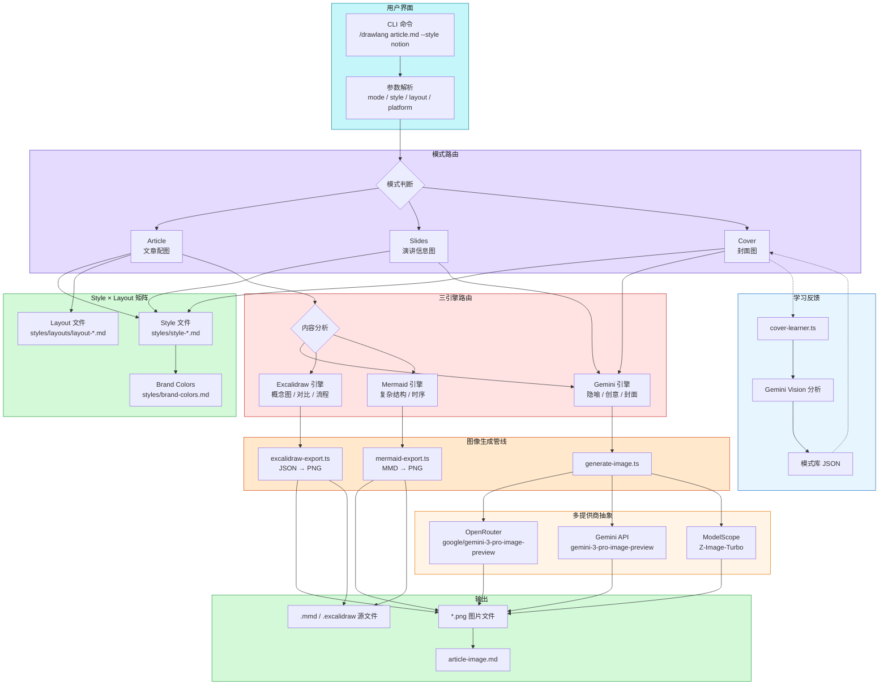
```mermaid
graph TB
    subgraph UserLayer["用户界面"]
        CLI["CLI 命令<br/>/drawlang article.md --style notion"]
        PARAMS["参数解析<br/>mode / style / layout / platform"]
    end

    subgraph ModeRouter["模式路由"]
        MODE{模式判断}
        ARTICLE["Article<br/>文章配图"]
        SLIDES["Slides<br/>演讲信息图"]
        COVER["Cover<br/>封面图"]
    end

    subgraph StyleSystem["Style × Layout 矩阵"]
        STYLE["Style 文件<br/>styles/style-*.md"]
        LAYOUT["Layout 文件<br/>styles/layouts/layout-*.md"]
        BRAND["Brand Colors<br/>styles/brand-colors.md"]
    end

    subgraph EngineRouter["三引擎路由"]
        ANALYZE{内容分析}
        GEMINI_E["Gemini 引擎<br/>隐喻 / 创意 / 封面"]
        EXCALIDRAW_E["Excalidraw 引擎<br/>概念图 / 对比 / 流程"]
        MERMAID_E["Mermaid 引擎<br/>复杂结构 / 时序"]
    end

    subgraph ImageGen["图像生成管线"]
        GEN_SCRIPT["generate-image.ts"]
        EXCAL_EXPORT["excalidraw-export.ts<br/>JSON → PNG"]
        MERMAID_EXPORT["mermaid-export.ts<br/>MMD → PNG"]
    end

    subgraph Providers["多提供商抽象"]
        OPENROUTER["OpenRouter<br/>google/gemini-3-pro-image-preview"]
        GEMINI_API["Gemini API<br/>gemini-3-pro-image-preview"]
        MODELSCOPE["ModelScope<br/>Z-Image-Turbo"]
    end

    subgraph Learning["学习反馈"]
        LEARNER["cover-learner.ts"]
        VISION["Gemini Vision 分析"]
        PATTERNS["模式库 JSON"]
    end

    subgraph Output["输出"]
        MD_OUT["article-image.md"]
        PNG_OUT["*.png 图片文件"]
        MMD_SRC[".mmd / .excalidraw 源文件"]
    end

    CLI --> PARAMS --> MODE
    MODE --> ARTICLE
    MODE --> SLIDES
    MODE --> COVER

    ARTICLE --> STYLE
    ARTICLE --> LAYOUT
    SLIDES --> STYLE
    COVER --> STYLE

    STYLE --> BRAND

    ARTICLE --> ANALYZE
    ANALYZE --> GEMINI_E
    ANALYZE --> EXCALIDRAW_E
    ANALYZE --> MERMAID_E
    SLIDES --> GEMINI_E
    COVER --> GEMINI_E
    GEMINI_E --> GEN_SCRIPT
    EXCALIDRAW_E --> EXCAL_EXPORT
    MERMAID_E --> MERMAID_EXPORT

    GEN_SCRIPT --> OPENROUTER
    GEN_SCRIPT --> GEMINI_API
    GEN_SCRIPT --> MODELSCOPE

    COVER -.-> LEARNER
    LEARNER --> VISION
    VISION --> PATTERNS
    PATTERNS -.-> COVER

    OPENROUTER --> PNG_OUT
    GEMINI_API --> PNG_OUT
    MODELSCOPE --> PNG_OUT
    EXCAL_EXPORT --> PNG_OUT
    MERMAID_EXPORT --> PNG_OUT

    PNG_OUT --> MD_OUT
    EXCAL_EXPORT --> MMD_SRC
    MERMAID_EXPORT --> MMD_SRC

    style UserLayer fill:#c5f6fa,stroke:#0c8599,color:#1a1a1a
    style ModeRouter fill:#e5dbff,stroke:#5f3dc4,color:#1a1a1a
    style StyleSystem fill:#d3f9d8,stroke:#2f9e44,color:#1a1a1a
    style EngineRouter fill:#ffe3e3,stroke:#c92a2a,color:#1a1a1a
    style ImageGen fill:#ffe8cc,stroke:#d9480f,color:#1a1a1a
    style Providers fill:#fff4e6,stroke:#e67700,color:#1a1a1a
    style Learning fill:#e7f5ff,stroke:#1971c2,color:#1a1a1a
    style Output fill:#d3f9d8,stroke:#2f9e44,color:#1a1a1a
```

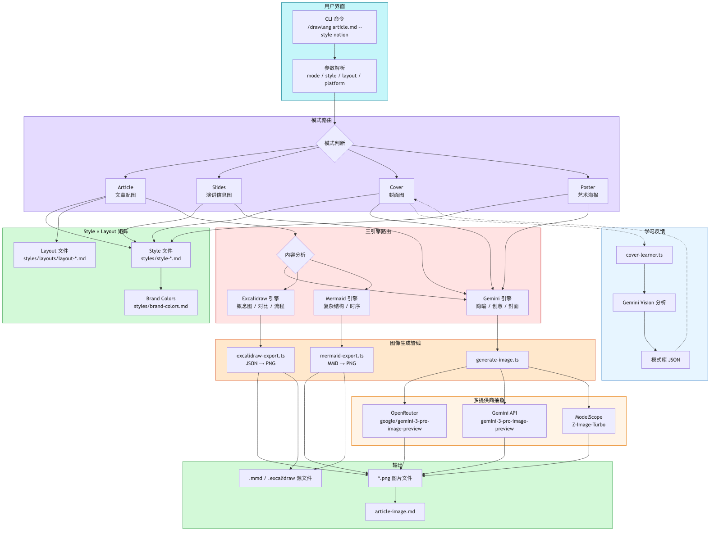

---

## 附录 B：图像生成能力详解

### B.1 generate-image.ts 核心管线

`scripts/generate-image.ts` 是 DrawLang 的图像生成核心，支持三家提供商、多候选生成、Style-Lock 参考图、Cover 学习等高级功能。

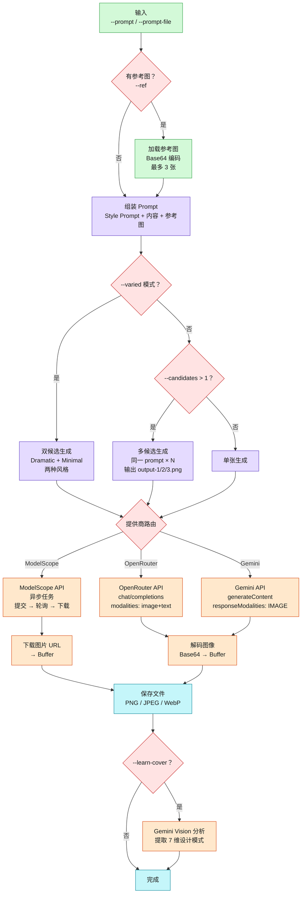
```mermaid
flowchart TD
    INPUT["输入<br/>--prompt / --prompt-file"] --> REF{有参考图？<br/>--ref}

    REF -->|是| LOAD_REF["加载参考图<br/>Base64 编码<br/>最多 3 张"]
    REF -->|否| BUILD_PROMPT

    LOAD_REF --> BUILD_PROMPT["组装 Prompt<br/>Style Prompt + 内容 + 参考图"]

    BUILD_PROMPT --> VARIED{--varied 模式？}
    VARIED -->|是| DUAL["双候选生成<br/>Dramatic + Minimal<br/>两种风格"]
    VARIED -->|否| CANDIDATES{--candidates > 1？}
    CANDIDATES -->|是| MULTI["多候选生成<br/>同一 prompt × N<br/>输出 output-1/2/3.png"]
    CANDIDATES -->|否| SINGLE["单张生成"]

    DUAL --> PROVIDER
    MULTI --> PROVIDER
    SINGLE --> PROVIDER

    PROVIDER{提供商路由} -->|OpenRouter| OR_API["OpenRouter API<br/>chat/completions<br/>modalities: image+text"]
    PROVIDER -->|Gemini| GEM_API["Gemini API<br/>generateContent<br/>responseModalities: IMAGE"]
    PROVIDER -->|ModelScope| MS_API["ModelScope API<br/>异步任务<br/>提交 → 轮询 → 下载"]

    OR_API --> DECODE["解码图像<br/>Base64 → Buffer"]
    GEM_API --> DECODE
    MS_API --> DOWNLOAD["下载图片 URL<br/>→ Buffer"]
    DOWNLOAD --> SAVE

    DECODE --> SAVE["保存文件<br/>PNG / JPEG / WebP"]

    SAVE --> LEARN{--learn-cover？}
    LEARN -->|是| ANALYZE["Gemini Vision 分析<br/>提取 7 维设计模式"]
    LEARN -->|否| DONE["完成"]
    ANALYZE --> DONE

    classDef input fill:#d3f9d8,stroke:#2f9e44,color:#1a1a1a
    classDef decision fill:#ffe3e3,stroke:#c92a2a,color:#1a1a1a
    classDef process fill:#e5dbff,stroke:#5f3dc4,color:#1a1a1a
    classDef action fill:#ffe8cc,stroke:#d9480f,color:#1a1a1a
    classDef output fill:#c5f6fa,stroke:#0c8599,color:#1a1a1a

    class INPUT,LOAD_REF input
    class REF,VARIED,CANDIDATES,PROVIDER,LEARN decision
    class BUILD_PROMPT,DUAL,MULTI,SINGLE process
    class OR_API,GEM_API,MS_API,DECODE,DOWNLOAD,ANALYZE action
    class SAVE,DONE output
```

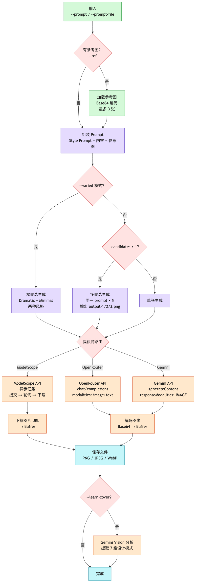

### B.2 支持的图像模型

| 提供商 | 默认模型 | API 模式 | 参考图支持 | 分辨率控制 |
| ------ | ------- | -------- | --------- | --------- |
| **OpenRouter** | `google/gemini-3-pro-image-preview` | 同步 chat/completions | 不支持 | `image_config.image_size: "2K"` |
| **Gemini** | `gemini-3-pro-image-preview` | 同步 generateContent | 支持（inlineData） | `imageConfig.imageSize: "2K"` |
| **ModelScope** | `Tongyi-MAI/Z-Image-Turbo` | 异步 task | 不支持 | 按模型默认 |

### B.3 宽高比支持

`generate-image.ts` 支持 10 种宽高比，覆盖所有常见平台：

| 宽高比 | 用途 |
| ------ | ---- |
| `16:9` | 正文配图、YouTube 封面、B 站封面（默认） |
| `9:16` | 竖版海报、Reels、抖音 |
| `3:4` | 小红书竖图 |
| `4:3` | 传统横版 |
| `1:1` | 专辑封面、头像、Instagram |
| `2:3` / `3:2` | 摄影、书籍封面 |
| `4:5` / `5:4` | Instagram 推荐 |
| `21:9` | 超宽横版、公众号封面近似 |

### B.4 高级功能

#### Style-Lock 参考图（`--ref`）

通过传入 1-3 张参考图，让新生成的图片"锁定"参考图的视觉风格：

```bash
# 单张参考图
npx -y bun generate-image.ts --prompt "..." --ref style-ref.png --output image.png

# 多张参考图（取风格交集）
npx -y bun generate-image.ts --prompt "..." --ref ref1.png --ref ref2.png --output image.png
```

**实现原理**：将参考图 Base64 编码后作为 Gemini API 的 `inlineData` 传入，配合提示词引导模型匹配风格。仅 Gemini 直连 API 支持此功能。

#### 多候选生成（`--candidates`）

生成多张候选图供用户选择最佳效果：

```bash
# 生成 3 张候选
npx -y bun generate-image.ts --prompt "..." --candidates 3 --output result.png
# 输出: result-1.png, result-2.png, result-3.png
```

#### Varied 双风格（`--varied`）

Cover 模式专用，自动生成两种互补风格：

```bash
npx -y bun generate-image.ts --prompt-file cover.txt --varied --output cover.png
# 输出: cover-1.png (Dramatic), cover-2.png (Minimal)
```

风格提示从 `prompts/varied-styles.md` 动态加载，支持用户自定义。

#### Cover 学习（`--learn-cover`）

从优秀封面中提取设计模式，持续提升生成质量：

```bash
# 分析一张高点击率封面
npx -y bun generate-image.ts --learn-cover good-cover.png --learn-note "CTR 8.5%"

# 查看已学习的模式
npx -y bun generate-image.ts --show-learnings
```

学习数据以 JSON 存储，后续生成时自动注入到 Cover System Prompt 中。

### B.5 Excalidraw 导出管线

`scripts/excalidraw-export.ts` 将 Excalidraw JSON 转为高分辨率 PNG：

```bash
npx -y bun excalidraw-export.ts -i diagram.excalidraw -o diagram.png -s 2
```

- **依赖**：`excalidraw-brute-export-cli`（Playwright Firefox 驱动）
- **缩放**：`-s 2` 表示 2 倍缩放（输出 2400×1600 for 1200×800 画布）
- **降级**：依赖未安装时提示手动打开 excalidraw.com 导出

### B.6 Mermaid 导出管线

`scripts/mermaid-export.ts` 将 Mermaid 代码转为高分辨率 PNG：

```bash
npx -y bun mermaid-export.ts -i flowchart.mmd -o flowchart.png -w 2400
```

- **宽度控制**：`-w 2400` 指定输出宽度（像素）
- **源文件保留**：`.mmd` 文件保留用于后续编辑
- **语义色板**：自动应用 DrawLang 定义的 7 色语义系统

### B.7 批量生成

`scripts/batch-generate.ts` 支持批量图像生成，含断点续传：

```bash
npx -y bun batch-generate.ts --input prompts.json --output-dir ./images
```

- **断点续传**：已生成的图片自动跳过
- **并发控制**：避免 API 限流
- **适用场景**：Slides 模式批量生成、文章多图配图

---

## 附录 C：示例图片生成命令

以下命令可用于生成本文档中的示例图片：

```bash
# Style × Layout 对比效果（基于 demo-article.md）
npx -y bun scripts/generate-image.ts --prompt-file prompts/demo-01-light-balanced.txt --output assets/design-doc/demo-01-light-balanced.png --aspect-ratio 16:9 --provider modelscope
npx -y bun scripts/generate-image.ts --prompt-file prompts/demo-02-notion-dense.txt --output assets/design-doc/demo-02-notion-dense.png --aspect-ratio 16:9 --provider modelscope
npx -y bun scripts/generate-image.ts --prompt-file prompts/demo-03-light-comparison.txt --output assets/design-doc/demo-03-light-comparison.png --aspect-ratio 16:9 --provider modelscope

# Cover 隐喻模式
npx -y bun scripts/generate-image.ts --prompt-file prompts/demo-04-cover.txt --output assets/design-doc/demo-04-cover.png --aspect-ratio 16:9 --provider modelscope

# Sparse 布局（单一视觉冲击）
npx -y bun scripts/generate-image.ts --prompt-file prompts/demo-05-light-sparse.txt --output assets/design-doc/demo-05-light-sparse.png --aspect-ratio 16:9 --provider modelscope

# Cover 封面图
/drawlang --mode cover --platform youtube --topic "Claude 4 深度评测"
```
